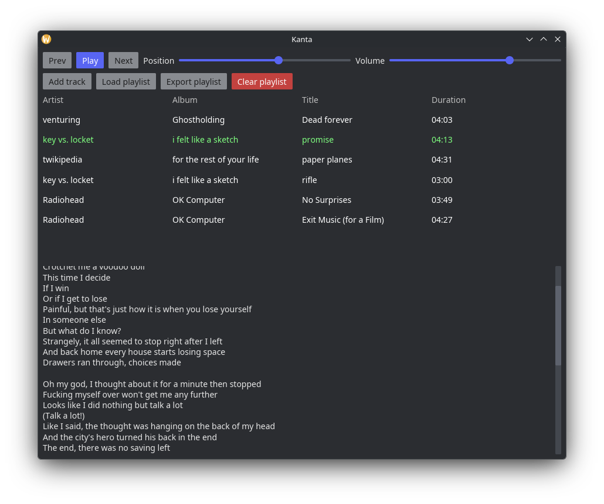

# Kanta

The worst music player you've ever seen. But at least it's in Rust.

## Features

- Music playing
- Lyrics view
- Playlist loading from `.m3u8`
- Playlist exporting to `.m3u8`
- Media control support (i.e. OS integration; MPRIS on Linux)

## Planned

- Removing tracks from playlist
- Track images
- Automatic track fetching
- Automatic lyric fetching
- Music folder analysis and organization

## Technology

| Purpose        | Technology                                          |
| -------------- | --------------------------------------------------- |
| GUI            | [Iced](https://iced.rs)                             |
| Audio playback | [Rodio](https://github.com/rustaudio/rodio)         |
| Track analysis | [Symphonia](https://github.com/pdeljanov/Symphonia) |
| Media controls | [Souvlaki](https://github.com/Sinono3/souvlaki)     |

## License

Kanta is licensed under the [GNU General Public License, version 3](./LICENSE).
